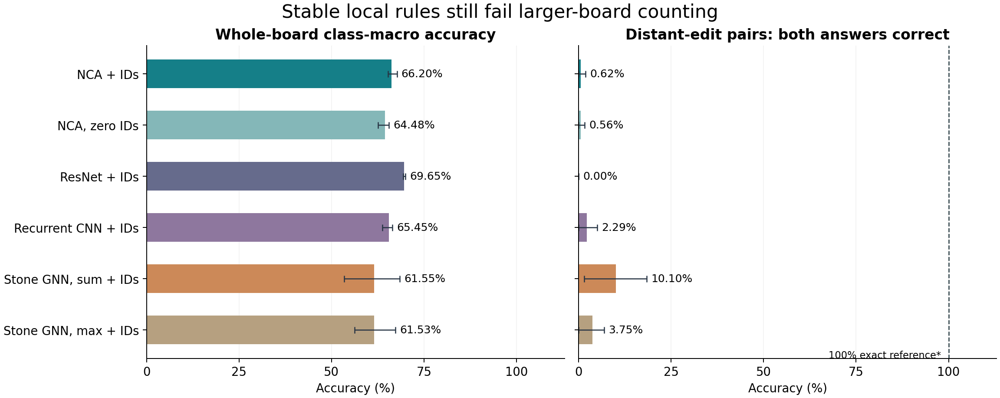
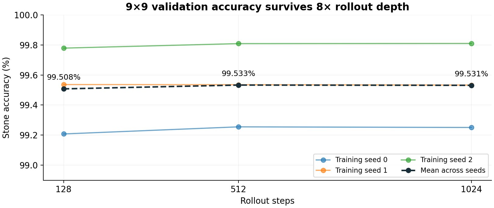

# NCA Go

### Can a local learned rule count distinct liberties on an unfamiliar board?

[Animations](docs/animations.md) · [Reproduce the results](docs/reproduce.md) · [Methods and limitations](docs/methods.md) · [Complete measurements and checkpoints](https://github.com/ash9241/nca-go/releases/tag/v1.0.0) · [Open experiments](docs/open-problems.md)

A neural cellular automaton applies the same small neural network at every location, repeatedly exchanging information with neighboring cells. This makes it an appealing candidate for learning algorithms: a rule trained on a small board can also run on a larger board, with more time for messages to travel.

We investigate that promise through **Go liberty counting**. Our experiments separate three questions that are easy to conflate: Can the network fit small boards? Can it remain stable when run longer? Can it use distant information correctly on larger boards?

**Our main result is a separation between stability and systematic generalization.** A 240,212-parameter NCA trained on sizes 5–9 retained **99.51% stone accuracy at 128 steps and 99.53% at 1,024 steps** on frozen 9×9 validation. Yet on 37×37 boards it achieved **66.20% class-macro accuracy**, and solved **0.625% of distant-edit witness pairs** at four times the relevant chain diameter. Six model conditions, each with three training seeds and matched supervised data, did not produce reliable larger-board counting. A subsequent maze positive control also fell short of its reliability gate.

This repository releases the implementation, successful and failed measurements, checkpoints, frozen evaluation boards, raw predictions, and recorded dynamics. It is an open research artifact, with an unresolved generalization problem and concrete experiments for investigating it.



*37×37 results; mean across three training seeds. Whiskers show the minimum and maximum seed, not confidence intervals. Repeated ID and firing draws are averaged within each seed. The separate hand-coded reference reaches 100% on the earlier five-geometry 37×37 witness audit; it is an algorithmic control, not a learned model or an evaluation on the newly frozen boards.*

## Why liberties make a useful test

A **chain** is an orthogonally connected group of same-color stones. Its **liberties** are the distinct empty points adjacent to any stone in that chain. Every stone in a chain receives the same target: 1, 2, 3, or 4+ liberties.

The word *distinct* matters. Several stones can touch the same empty point. A message can also return through another route around a cycle. Adding local counts therefore does not generally recover the number of liberties. A successful distributed algorithm needs a way to recognize repeated information.

For chain $C$, the target is

$$
y(C)=\min\!\left(4,\left|\bigcup_{v\in C}\{u:u\sim v,\;u\text{ is empty}\}\right|\right).
$$

A local classifier can perform well when the answer is usually visible nearby. To test actual communication, we construct **witness pairs** with the same query neighborhood and a distant edit that changes the correct answer. The primary metric requires **both answers to be correct**. A constant answer cannot pass an outcome-changing pair.


*The first prespecified snake witness for training seed 0, with coupled randomness. The correct query counts are 1 and 2; the final learned answers are 4+ and 4+. The animation is reconstructed from saved learned states and checked against the recorded evaluation predictions. See the [gallery](docs/animations.md) for all seeds, small-board examples, richer tasks, and the exact reference.*

## The computational model

Each grid cell carries immutable board information and mutable memory. A shared network observes a 3×3 neighborhood and proposes a residual update. A random firing mask determines which cells update on each step. For the main Go model, the update has the schematic form

$$
h_v^{t+1}=\Pi\!\left(h_v^t+m_v^t\,g_\theta\!\left(P_\theta(x^t)_{v}\right)\right),\qquad m_v^t\sim\mathrm{Bernoulli}(0.8).
$$

Here $P_\theta$ is local perception, $g_\theta$ includes the learned gated update, and $\Pi$ projects mutable channel groups into unit balls. Input channels are restored unchanged. The rule has no global attention, global pooling, or iteration counter. A readout turns local state into a liberty class. The [implementation](ncago/nca/model.py) specifies the exact ordering and parameterization.

With a radius-one neighborhood, information cannot travel farther than one grid cell per update. Running longer expands the possible receptive field; it does not guarantee that the learned state preserves or uses the arriving information. **A stable wrong answer is still a wrong answer.**

This design follows the broader NCA tradition introduced by [Mordvintsev et al.](https://distill.pub/2020/growing-ca/) and the local recurrent reasoning setting of [Etcheverry et al.](https://arxiv.org/abs/2609.36126). Our Go model and training adaptations are a separate experiment.

## What improved, and what did not

The final recipe uses online legal-random and constructed positions on a 9×9 canvas, replayed states, damage and noise, random horizons between 32 and 128, late supervision, and a penalty on late state changes. A 32-step gradient window permits longer forward trajectories. Bounded memory, scaled ID inputs, and consistent IDs during replay were added after less stable or poorly fitting pilots. Final EMA checkpoints were selected using small-board validation before the final larger-board data were generated.

The main NCA has 96 channels: 40 immutable inputs, including 32 random identifier channels, and 56 mutable channels. The identifiers are frozen ±1 values within a trajectory, scaled by $1/\sqrt{32}$ in perception, and resampled for fresh rollouts. They carry no labels. The no-ID control reserves the same channels and fills them with zeros.

All three main NCA seeds passed the specified small-board checks: at least 95% macro accuracy, at most 0.2 percentage points of stone-accuracy change from 128 to 512 and 1,024 steps, and at most 0.2 points of accuracy range across eight ID fields at depth 128. These are finite tests of accuracy stability, not a proof of dynamical convergence or invariance to every random ID assignment.



*The same final checkpoints retain their small-board accuracy at extended depth. This figure uses stone accuracy on 9×9 validation; the larger-board comparison uses class-macro accuracy on separate final data. They are different metrics and populations.*

Because several changes were combined, the successful recipe does not isolate the causal contribution of replay, normalization, IDs, or any one regularizer. The [training inventory](results/published/training_inventory.json) and release preserve the pilots, including failed recipes.

## What we compared

The main cap-4 experiment contains **18 final checkpoints**: six conditions × three independent training seeds. Candidate and actual supervised-batch hashes agree across conditions. Parameters are approximately matched; architectures differ in communication and per-update compute. The ResNet has a full-board receptive field at 37×37. The recurrent CNN shares weights over time. The GNNs exchange messages along same-color stone edges, using sum or max aggregation.

<!-- main-table:start -->
| Model | Macro accuracy | Witness pairs both correct | Cycle controls both correct |
|---|---:|---:|---:|
| NCA + IDs | 66.20 | 0.625 | 61.72 |
| NCA, zero IDs | 64.48 | 0.556 | 58.33 |
| ResNet + IDs | 69.65 | 0.000 | 60.42 |
| Recurrent CNN + IDs | 65.45 | 2.292 | 55.99 |
| Stone GNN, sum + IDs | 61.55 | 10.104 | 78.91 |
| Stone GNN, max + IDs | 61.53 | 3.750 | 80.21 |
<!-- main-table:end -->

*All values are percentages at 37×37 and $D/\mathrm{diameter}=4$. Macro accuracy averages per-class recall over supported classes. Witness scores average the five equally sized geometry families; cycle controls are label-preserving cyclic/broken-cycle pairs and therefore measure a different property. The feedforward ResNet runs once; additional rollout depth applies to recurrent models only. [Per-seed values](reports/research_followup/outcome_summary.json) and [all sizes and depths](reports/research_followup/final_accuracy.csv) are available.*

The ResNet has the highest mean whole-board macro score here, while the sum GNN has the highest mean outcome-changing pair score. Neither result approaches a reliable counting algorithm. The two GNNs also fit the training distribution differently, so their sum/max difference does **not** establish that double counting caused the failures. Some diagnostic baselines were evaluated below the 95% macro qualification threshold under the historical primary-model exception; the [methods](docs/methods.md) document this limitation and the stricter future rule.

### What the diagnostics say

The earlier checkpoint audit stratifies errors by chain diameter, graph cycles, chain size, edge distance, and the strict grid light cone. At 37×37 and 32 steps, only **8.54% of errors** have even one relevant liberty outside that light cone; at 13×13, 19×19, and 25×25, none do. Insufficient radius 32 therefore cannot explain all the errors. Long chain distance is associated with failure, but the grid NCA is not forced to communicate along stones.

A cycle comparison matched on size, class, and geometry-related covariates has common support for only 6–9% of stone trials and shows no consistent cycle penalty. These observations narrow the explanation without proving a specific shortcut. Confusion matrices distinguish overcounts from undercounts; state-change and prediction-flip traces show what happens after step 32. See the [checkpoint audit](reports/checkpoint_audit/SUMMARY.md), [rollout traces](reports/research_followup/rollout_dynamics.csv), and complete release for the matrices.

### An exact local algorithm exists

Our hand-coded reference gives each empty point an identifier and repeatedly unions the adjacent sets along the stone graph, retaining the four smallest IDs. With unique IDs and enough communication rounds, this computes the capped number of distinct liberties even around cycles. The reference reaches 100% on the earlier 37×37 witness audit at four times diameter. Finite random IDs can collide; the implementation and audit record that limitation.

This reference establishes that the task admits a local solution under those assumptions. The learned dense-ID NCA did not discover comparable behavior. It also provides intermediate targets for a future experiment using sparse bucket IDs and saturated message channels.

## The maze positive control

A failure on counting is difficult to interpret if the same pipeline cannot reliably reproduce a simpler extrapolating task. We therefore implemented a paper-based Maze-OOD NCA from [Etcheverry et al.](https://arxiv.org/html/2609.36126v1), with immutable clues, sample replay, noise, damage, and target swaps. This is an independent implementation, not the authors' released checkpoint. Our model has 11,888 parameters; the paper lists approximately 10K.

We trained on 50,000 public 9×9 mazes from [Easy-to-Hard Data](https://github.com/aks2203/easy-to-hard-data). Every imported label was independently checked by BFS. Small-board qualification removes training/test overlap under rotations and reflections. Each model solves all 512 qualifying 9×9 mazes at 100, 400, and 800 steps.

<!-- maze-table:start -->
| Training seed / updates | 9×9 exact, all three depths | 59×59 exact | 201×201 exact |
|---|---:|---:|---:|
| Seed 0 / 5,000 | 100% | 98.18% | 48.44% |
| Seed 1 / 5,000 | 100% | 88.80% | 1.56% |
| Seed 2 / 5,000 | 100% | 81.90% | 8.33% |
| Seed 0 / 10,000 (continuation) | 100% | 98.96% | 66.67% |
<!-- maze-table:end -->

*Exact-path accuracy, averaged over three inference seeds with one rollout per board per seed; 256 boards at 59×59 and 64 at 201×201. Depths are 2,000 and 13,000 respectively. The 10,000-update continuation uses new confirmation subsets, so its improvement is not a paired estimate of the effect of extra training. The three inference draws are not three independent training runs.*


*One successful 59×59 example. The gallery also shows two 201×201 failures: a nearly correct path with five extra cells, and a failure missing 4,301 path cells. Exact-path scoring makes these failures visible even when cell accuracy is high.*

**No maze run passed the full reliability gate** of at least 95% exact accuracy at both larger sizes for every inference seed. Extending inference to 52,000 steps on a diagnostic subset did not repair the original model. A local leaf-pruning reference solved all checked tree mazes. This leaves a reproduction or training-reliability gap and prevents us from attributing the Go failure specifically to distinct counting.

For context, the NCA paper reports 100% at 59×59 and 201×201 for its Maze-OOD configuration. [Bansal et al.](https://arxiv.org/abs/2202.05826) study explicit input recall and progressive recurrent training; their reported DeepThink comparison is 97.3% and 74.0% at these sizes. Those published numbers use their own evaluation settings and are related-work context, not matched runs in our benchmark. We did not train a Bansal DT-Recall baseline.

## Exploratory tasks beyond cap 4

Nine additional NCA checkpoints cover three seeds each for cap-16 liberties, static simple-eye counts, and a finite first-capture race. They test whether the approach transfers to less locally saturated targets.

<!-- richer-table:start -->
| Task | Macro accuracy | Outcome-changing pairs both correct | Cycle controls both correct |
|---|---:|---:|---:|
| Liberties 1–15 / 16+ | 33.77% | 0.104% | 4.43% |
| Simple eyes 0–7 / 8+ | 23.19% | 0.208% | 24.22% |
| Finite first-capture race | 68.45% | 0.260% | 38.80% |
<!-- richer-table:end -->

*37-board results at four times relevant diameter. Race whole-board tests use 5×37 rectangles on a 37×37 canvas; paired race witnesses use full 37×37 constructions. Race labels are nominal, so overcount/undercount language does not apply.*

These results do not support strong richer-task claims. Eye-set deduplication exhausted the constructed family at 9×9, leaving 255 legal-random boards and one constructed board, with several unsupported classes. Race cycle controls span 12.5–87.5% across only three training seeds. Static eye counts are not Benson life; the race is not full Go. The [FAR adversarial Go work](https://arxiv.org/abs/2211.00241) motivates examining cyclic geometry, but we did not measure KataGo robustness, FAR attack success, or playing strength. Richer tasks, ladders, Benson, and a player remain gated.

## Use this repository

Python 3.11 or 3.12 is required. CPU suffices for tests and rescoring saved predictions; training and full neural reevaluation are substantially faster on a GPU. The recorded experiments used NVIDIA A100s.

```bash
git clone https://github.com/ash9241/nca-go.git
cd nca-go
python3.11 -m venv .venv
source .venv/bin/activate
python -m pip install -e .
python -m pytest -q
python tools/published_results.py
```

The last command regenerates the compact scientific figures and README tables from the committed measurements. For a Linux NVIDIA environment, install `jax[cuda12]==0.6.2` in addition to the pinned package requirements.

The [v1.0.0 release](https://github.com/ash9241/nca-go/releases/tag/v1.0.0) contains three checksum-verified archives:

| Asset | Contents |
|---|---|
| `go-evaluation-v1.zip` | 27 final Go checkpoints, frozen boards, raw predictions, rollout states, scientific audit records, and original code snapshots |
| `maze-control-v1.zip` | Four maze runs, checkpoints and continuation state, converted public data, raw predictions, and source snapshots |
| `measurements-v1.zip` | Full numerical tables, all recorded animations, historical diagnostics, learning curves, confusion matrices, and detailed appendices |

See [reproduction instructions](docs/reproduce.md) for extraction, independent NumPy rescoring, media verification, and exact training commands. Checkpoints are scientific data; the archives document their scope and hashes. Go archives support final-inference verification, not bitwise replay of every exploratory training run.

The source is organized around [local rules and state updates](ncago/nca/model.py), [online Go generators and witnesses](ncago/go/research_data.py), [matched baselines](ncago/baselines/research.py), [training](ncago/experiments/research_train.py), [frozen evaluation](ncago/experiments/research_eval.py), and [the maze control](ncago/experiments/maze_control.py).

## What would change the conclusion?

The immediate goal is a reliable positive control across training seeds. After that, a common-generator ladder—marked-point reachability, atari, then cap 4—can distinguish communication from distinctness. Sparse one-hot bucket IDs, intermediate set-union supervision, and an ID-consistency loss make the algorithmic hypothesis easier to test. Training on sizes 5–19 and testing 25–49 would separate extreme distribution shift from a more modest extrapolation test.

These are **proposed experiments**, not results in this release. The [open-problem guide](docs/open-problems.md) specifies gates and counterevidence, and the [prospective configuration](configs/next_counting_protocol.json) records the held work. Contributions that reproduce failures, improve the positive control, or pass the witness tests are particularly useful.

## Citation and reuse

This is a research software release, not a peer-reviewed paper. Cite the version or commit used; [CITATION.cff](CITATION.cff) provides metadata. Source and original project artifacts are released under the [MIT license](LICENSE). The public maze benchmark retains its [upstream license and attribution](docs/third-party.md). The experiments and repository were developed with substantial assistance from OpenAI Codex; claims here are tied to saved measurements and stated limitations.

**Aishwarya Das · October 2026**
