# Recorded dynamics

These animations show saved states from actual computations. The Go learned examples were selected by a fixed position rule; the maze gallery deliberately includes a success and two different failure modes. Illustrations do not replace aggregate evaluation.

## Main cap-4 NCA: all three seeds

### Training seed 0

First final board; ID draw0; selected before predictions.

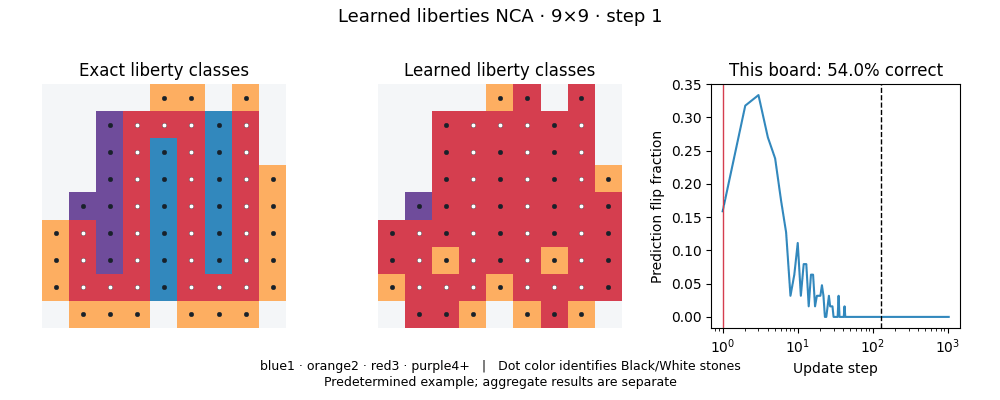

[MP4](../reports/research_followup/media/20261007T025650760669Z_1434950c_s0/first_final_9.mp4) · [Provenance](../reports/research_followup/media/20261007T025650760669Z_1434950c_s0/manifest.json)

First prespecified witness family pair; coupled fixed-depth evaluator keys; ID draw0.

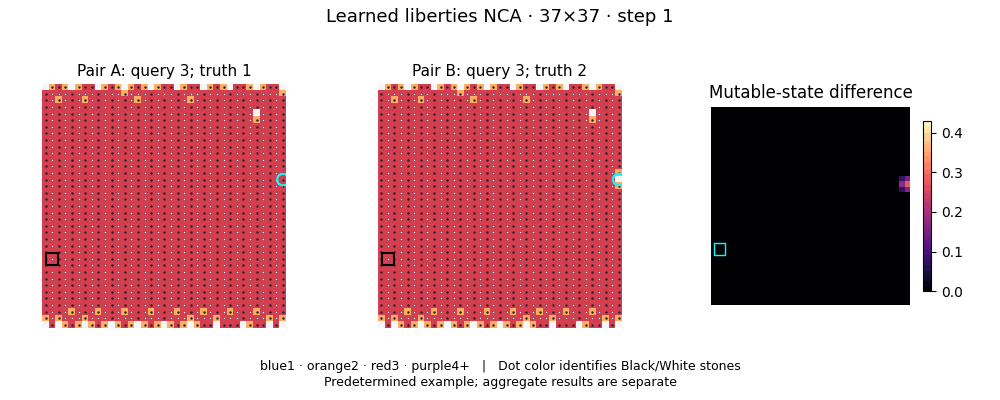

[MP4](../reports/research_followup/media/20261007T025650760669Z_1434950c_s0/first_snake_37.mp4) · [Provenance](../reports/research_followup/media/20261007T025650760669Z_1434950c_s0/manifest.json)

### Training seed 1

First final board; ID draw0; selected before predictions.

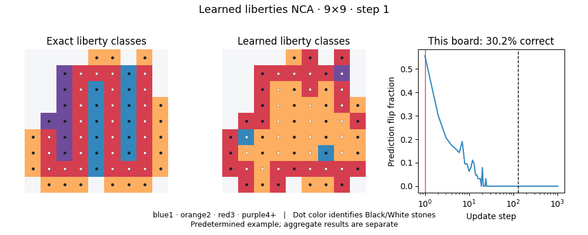

[MP4](../reports/research_followup/media/20261007T025651578943Z_3fac6ab2_s1/first_final_9.mp4) · [Provenance](../reports/research_followup/media/20261007T025651578943Z_3fac6ab2_s1/manifest.json)

First prespecified witness family pair; coupled fixed-depth evaluator keys; ID draw0.

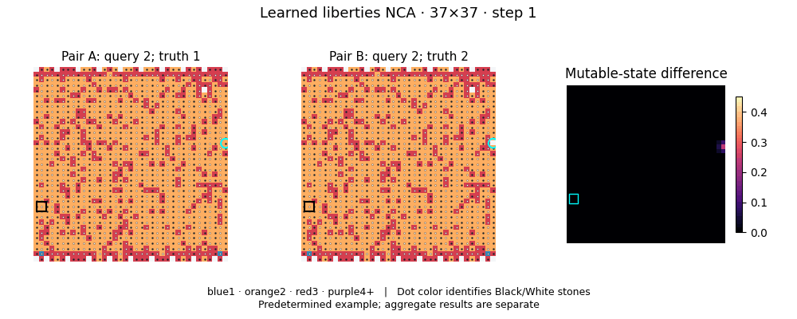

[MP4](../reports/research_followup/media/20261007T025651578943Z_3fac6ab2_s1/first_snake_37.mp4) · [Provenance](../reports/research_followup/media/20261007T025651578943Z_3fac6ab2_s1/manifest.json)

### Training seed 2

First final board; ID draw0; selected before predictions.

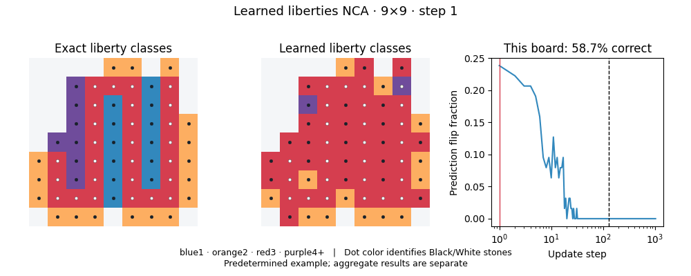

[MP4](../reports/research_followup/media/20261007T025651586214Z_b21f95e9_s2/first_final_9.mp4) · [Provenance](../reports/research_followup/media/20261007T025651586214Z_b21f95e9_s2/manifest.json)

First prespecified witness family pair; coupled fixed-depth evaluator keys; ID draw0.

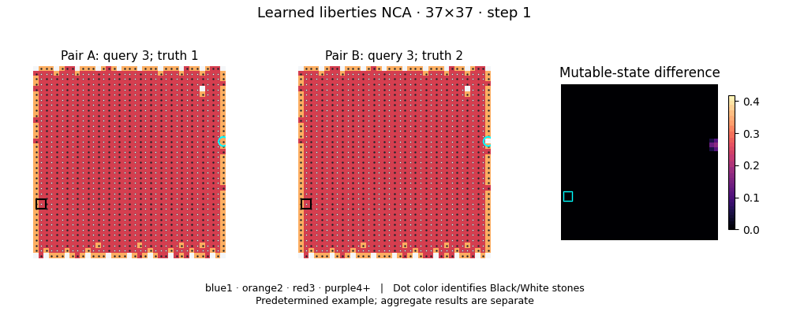

[MP4](../reports/research_followup/media/20261007T025651586214Z_b21f95e9_s2/first_snake_37.mp4) · [Provenance](../reports/research_followup/media/20261007T025651586214Z_b21f95e9_s2/manifest.json)

## Exact local reference

This animation is hand-coded set-union propagation, not a learned model. It establishes an algorithmic control under its identifier and depth assumptions.

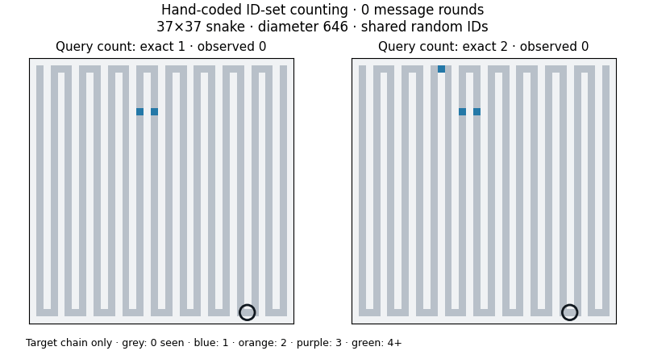

## Maze positive control

59×59: a correctly solved maze.

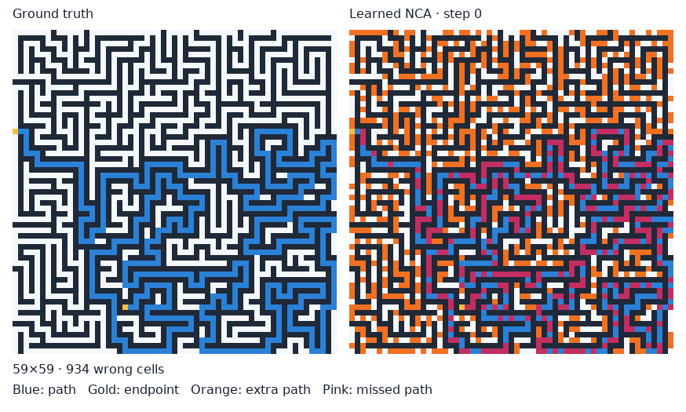

201×201: five extra predicted path cells.

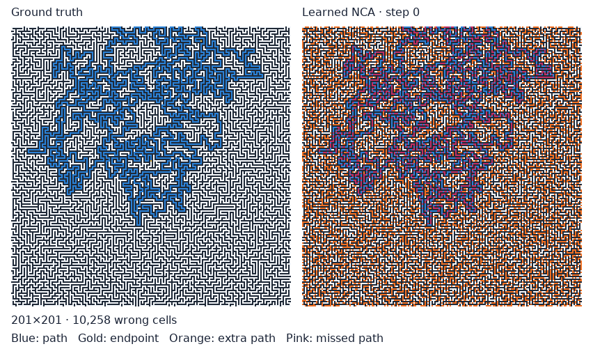

201×201: 4,301 missed path cells.

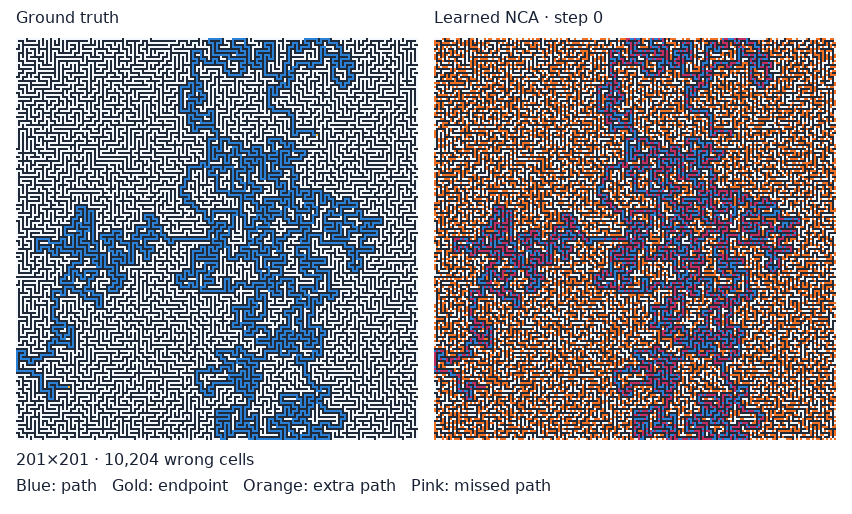

## Exploratory richer-task NCAs

These are failed extrapolation experiments. Simple eyes and finite races are restricted synthetic tasks; see the methods for domain and class-support limitations.

sealed_eyes_20261007 · seed 1

First prespecified witness family pair; coupled fixed-depth evaluator keys; ID draw0.

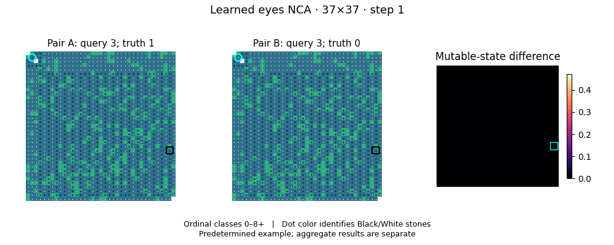

[MP4](../reports/research_followup/media/20261007T052244835360Z_9a81e6eb_s1/first_eye_witness_37.mp4) · [Provenance](../reports/research_followup/media/20261007T052244835360Z_9a81e6eb_s1/manifest.json)

sealed_eyes_20261007 · seed 2

First prespecified witness family pair; coupled fixed-depth evaluator keys; ID draw0.

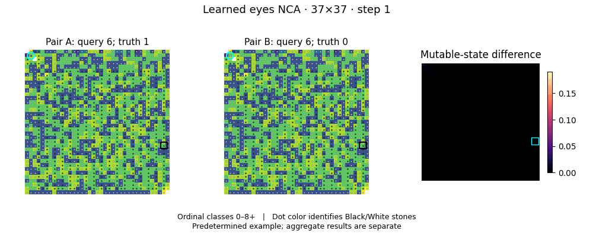

[MP4](../reports/research_followup/media/20261007T052244856336Z_1c743572_s2/first_eye_witness_37.mp4) · [Provenance](../reports/research_followup/media/20261007T052244856336Z_1c743572_s2/manifest.json)

sealed_eyes_20261007 · seed 0

First prespecified witness family pair; coupled fixed-depth evaluator keys; ID draw0.

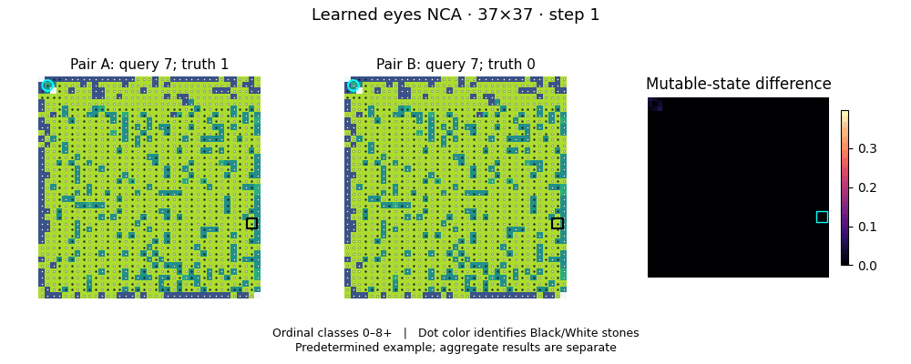

[MP4](../reports/research_followup/media/20261007T052244865495Z_3db0aeb4_s0/first_eye_witness_37.mp4) · [Provenance](../reports/research_followup/media/20261007T052244865495Z_3db0aeb4_s0/manifest.json)

sealed_lib16_20261007 · seed 0

First snake witness above cap4; coupled fixed-depth evaluator keys; ID draw0.

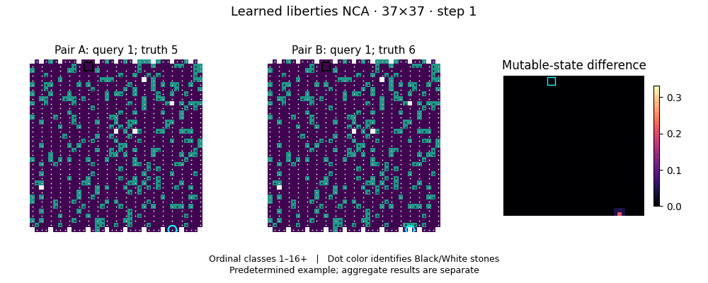

[MP4](../reports/research_followup/media/20261007T053936157132Z_53ec7cd3_s0/first_snake_37.mp4) · [Provenance](../reports/research_followup/media/20261007T053936157132Z_53ec7cd3_s0/manifest.json)

sealed_lib16_20261007 · seed 2

First snake witness above cap4; coupled fixed-depth evaluator keys; ID draw0.

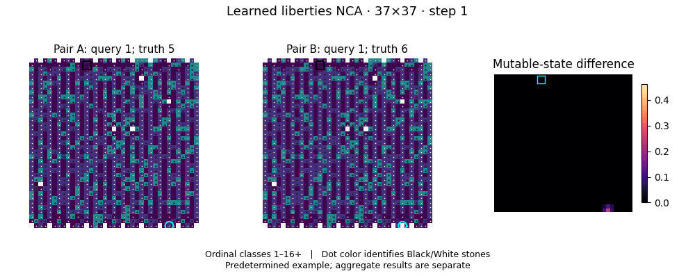

[MP4](../reports/research_followup/media/20261007T053936191430Z_55131ebc_s2/first_snake_37.mp4) · [Provenance](../reports/research_followup/media/20261007T053936191430Z_55131ebc_s2/manifest.json)

sealed_lib16_20261007 · seed 1

First snake witness above cap4; coupled fixed-depth evaluator keys; ID draw0.

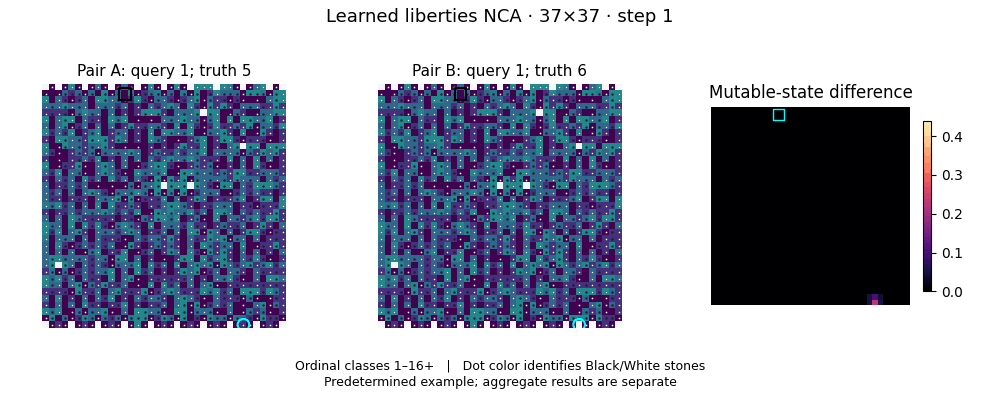

[MP4](../reports/research_followup/media/20261007T053936243064Z_630aa46f_s1/first_snake_37.mp4) · [Provenance](../reports/research_followup/media/20261007T053936243064Z_630aa46f_s1/manifest.json)

sealed_race_20261007 · seed 2

First prespecified witness family pair; coupled fixed-depth evaluator keys; ID draw0.

[MP4](../reports/research_followup/media/20261007T071255749237Z_eeccb8cc_s2/first_race_witness_37.mp4) · [Provenance](../reports/research_followup/media/20261007T071255749237Z_eeccb8cc_s2/manifest.json)

sealed_race_20261007 · seed 1

First prespecified witness family pair; coupled fixed-depth evaluator keys; ID draw0.

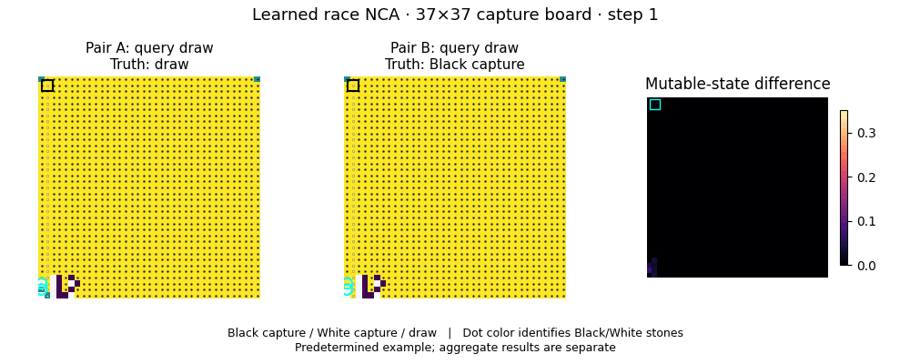

[MP4](../reports/research_followup/media/20261007T071255960308Z_5ea1694f_s1/first_race_witness_37.mp4) · [Provenance](../reports/research_followup/media/20261007T071255960308Z_5ea1694f_s1/manifest.json)

sealed_race_20261007 · seed 0

First prespecified witness family pair; coupled fixed-depth evaluator keys; ID draw0.

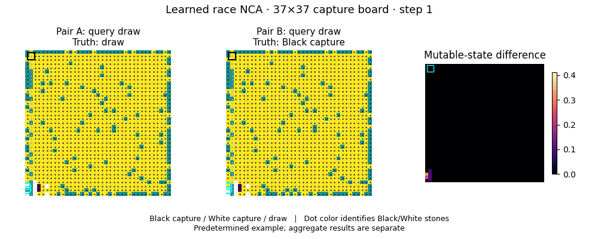

[MP4](../reports/research_followup/media/20261007T071256064661Z_5e32ae36_s0/first_race_witness_37.mp4) · [Provenance](../reports/research_followup/media/20261007T071256064661Z_5e32ae36_s0/manifest.json)

## Earlier experiments

Historical rollout and pipeline illustrations are retained below. Their settings differ from the final cohort; smoke-test animations do not establish task success. Some files are identical copies from earlier share packages.

- [reports/figures/F4_0.gif](../reports/figures/F4_0.gif)
- [reports/figures/F4_1.gif](../reports/figures/F4_1.gif)
- [reports/figures/F4_10.gif](../reports/figures/F4_10.gif)
- [reports/figures/F4_11.gif](../reports/figures/F4_11.gif)
- [reports/figures/F4_12.gif](../reports/figures/F4_12.gif)
- [reports/figures/F4_13.gif](../reports/figures/F4_13.gif)
- [reports/figures/F4_14.gif](../reports/figures/F4_14.gif)
- [reports/figures/F4_15.gif](../reports/figures/F4_15.gif)
- [reports/figures/F4_16.gif](../reports/figures/F4_16.gif)
- [reports/figures/F4_17.gif](../reports/figures/F4_17.gif)
- [reports/figures/F4_18.gif](../reports/figures/F4_18.gif)
- [reports/figures/F4_19.gif](../reports/figures/F4_19.gif)
- [reports/figures/F4_2.gif](../reports/figures/F4_2.gif)
- [reports/figures/F4_20.gif](../reports/figures/F4_20.gif)
- [reports/figures/F4_21.gif](../reports/figures/F4_21.gif)
- [reports/figures/F4_3.gif](../reports/figures/F4_3.gif)
- [reports/figures/F4_4.gif](../reports/figures/F4_4.gif)
- [reports/figures/F4_5.gif](../reports/figures/F4_5.gif)
- [reports/figures/F4_6.gif](../reports/figures/F4_6.gif)
- [reports/figures/F4_7.gif](../reports/figures/F4_7.gif)
- [reports/figures/F4_8.gif](../reports/figures/F4_8.gif)
- [reports/figures/F4_9.gif](../reports/figures/F4_9.gif)
- [reports/figures/gpu_rollout.gif](../reports/figures/gpu_rollout.gif)
- [reports/shareable/media/F4_0.gif](../reports/shareable/media/F4_0.gif)
- [reports/shareable/media/F4_1.gif](../reports/shareable/media/F4_1.gif)
- [reports/shareable/media/F4_10.gif](../reports/shareable/media/F4_10.gif)
- [reports/shareable/media/F4_11.gif](../reports/shareable/media/F4_11.gif)
- [reports/shareable/media/F4_12.gif](../reports/shareable/media/F4_12.gif)
- [reports/shareable/media/F4_13.gif](../reports/shareable/media/F4_13.gif)
- [reports/shareable/media/F4_14.gif](../reports/shareable/media/F4_14.gif)
- [reports/shareable/media/F4_15.gif](../reports/shareable/media/F4_15.gif)
- [reports/shareable/media/F4_16.gif](../reports/shareable/media/F4_16.gif)
- [reports/shareable/media/F4_17.gif](../reports/shareable/media/F4_17.gif)
- [reports/shareable/media/F4_18.gif](../reports/shareable/media/F4_18.gif)
- [reports/shareable/media/F4_19.gif](../reports/shareable/media/F4_19.gif)
- [reports/shareable/media/F4_2.gif](../reports/shareable/media/F4_2.gif)
- [reports/shareable/media/F4_20.gif](../reports/shareable/media/F4_20.gif)
- [reports/shareable/media/F4_21.gif](../reports/shareable/media/F4_21.gif)
- [reports/shareable/media/F4_3.gif](../reports/shareable/media/F4_3.gif)
- [reports/shareable/media/F4_4.gif](../reports/shareable/media/F4_4.gif)
- [reports/shareable/media/F4_5.gif](../reports/shareable/media/F4_5.gif)
- [reports/shareable/media/F4_6.gif](../reports/shareable/media/F4_6.gif)
- [reports/shareable/media/F4_7.gif](../reports/shareable/media/F4_7.gif)
- [reports/shareable/media/F4_8.gif](../reports/shareable/media/F4_8.gif)
- [reports/shareable/media/F4_9.gif](../reports/shareable/media/F4_9.gif)
- [reports/shareable/media/distant_pair_rollout.gif](../reports/shareable/media/distant_pair_rollout.gif)
- [reports/shareable/media/gpu_rollout.gif](../reports/shareable/media/gpu_rollout.gif)
